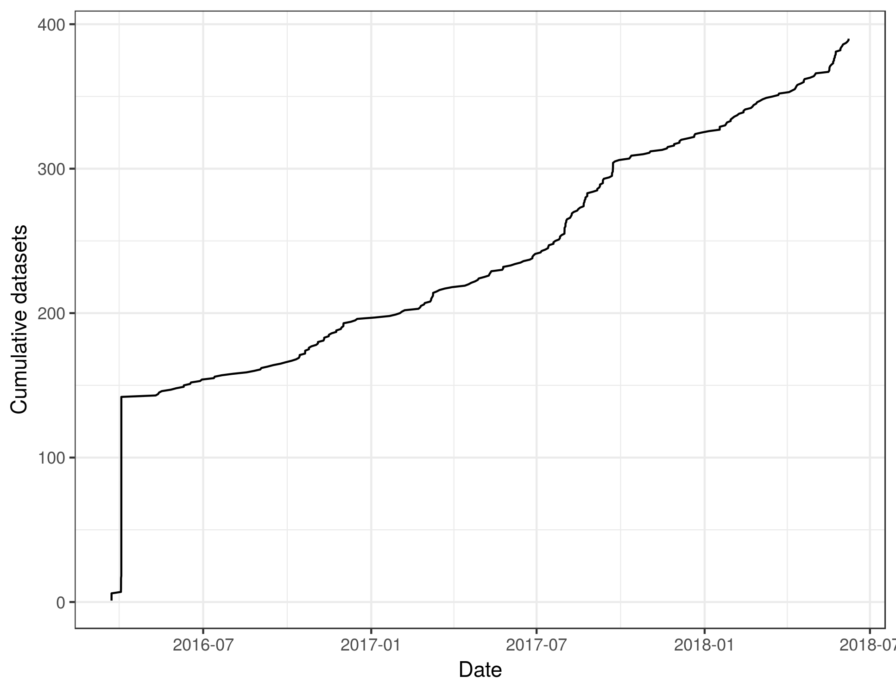

### 1) a table of the number of data sets in the Arctic Data Center (only count one version for each data set) for each NSF award number?  

```{r message = FALSE}
summary <- readr::read_csv("funding_summary.csv")
head(summary)
```

```{r message = FALSE}
summary_simple <- readr::read_csv("funding_summary_simple.csv")
head(summary_simple)
```

### 2) a graph showing number of NSF awards represented in the ADC over time?

Using the `pubDate` field in the EML:


Using the `dateUploaded` field associated with the EML file: 

