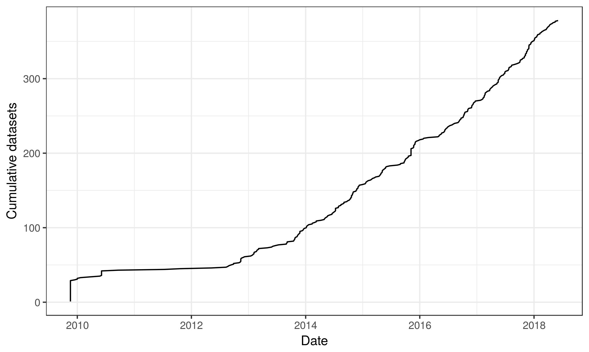
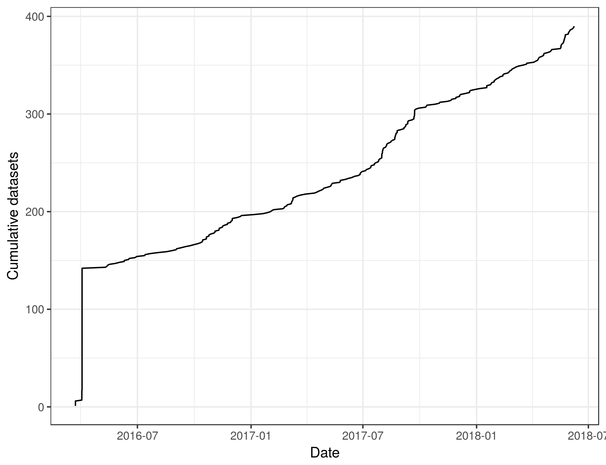

arcticfunding
================

### 1) a table of the number of data sets in the Arctic Data Center (only count one version for each data set) for each NSF award number?

``` r
summary <- readr::read_csv("funding_summary.csv")
head(summary)
```

    ## # A tibble: 6 x 11
    ##   funding_num n_datasets dataset_ids      funding_text min_pubDate        
    ##   <chr>            <int> <chr>            <chr>        <dttm>             
    ## 1 0125399             12 autogen.2016032… 0125399      NA                 
    ## 2 0229302              1 autogen.2016032… 0229302      2016-09-06 00:00:00
    ## 3 0229766              2 autogen.2016032… 0229766      NA                 
    ## 4 0230236              2 autogen.2016032… NSF Award 0… 2013-10-24 00:00:00
    ## 5 0244097              7 autogen.2016032… 0244097      2013-11-09 00:00:00
    ## 6 0326109              1 autogen.2016032… 0326109      2009-11-18 00:00:00
    ## # ... with 6 more variables: min_dateUploaded <dttm>, date <chr>,
    ## #   expDate <chr>, fundProgramName <chr>, startDate <chr>, title <chr>

``` r
summary_simple <- readr::read_csv("funding_summary_simple.csv")
head(summary_simple)
```

    ## # A tibble: 6 x 6
    ##   funding_num funding_text      n_datasets nsf_match min_pubDate        
    ##   <chr>       <chr>                  <int> <lgl>     <dttm>             
    ## 1 0125399     0125399                   12 TRUE      NA                 
    ## 2 0229302     0229302                    1 TRUE      2016-09-06 00:00:00
    ## 3 0229766     0229766                    2 TRUE      NA                 
    ## 4 0230236     NSF Award 0230236          2 TRUE      2013-10-24 00:00:00
    ## 5 0244097     0244097                    7 TRUE      2013-11-09 00:00:00
    ## 6 0326109     0326109                    1 TRUE      2009-11-18 00:00:00
    ## # ... with 1 more variable: min_dateUploaded <dttm>

### 2) a graph showing number of NSF awards represented in the ADC over time?

Using the `pubDate` field in the EML:



Using the `dateUploaded` field associated with the EML file:


